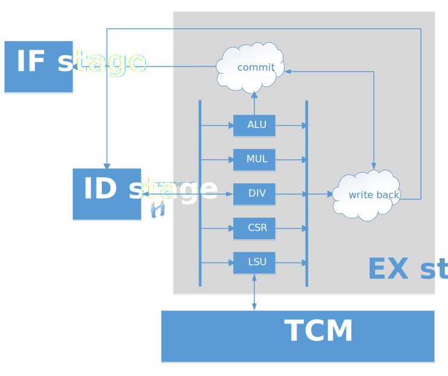

.. _ex-stage:

Instruction Execution Stage
============================

:file:`rtl/core/rvant_ex_stage.sv`

   RVAnt EX Stage

The EX stage finsh 3 task:

- execute the instruction
- commit the instruction
- write back the result to ``RF``

The following content decribes the execution of instruction only, check out :ref:`commit` and :ref: `wb` for more commit and write-back details. All instructions can be executed by 3 sub-block:

- ``ALU``
- ``LSU``
- ``CSR``

ALU
------

:file:`rtl/core/rvant_alu.sv`

The ``ALU`` (Arithmetic-Logic Unit) is a purly combinational logic block that carries out integer arithmetic and logic operations. It also computes target address for branch/jump instructions and memory address for load/store instructions. The ALU contains following blocks:

- adder
- comparator
- logic unit
- shifter

.. _mult-div:

Multiplication and Division
----------------------------

:file:`rtl/core/rvant_muldiv.sv`

The multiplier has two option:

Fast Single-cycle Multipler
    This implementation is based on radix-4 Booth-Wallace architecture.

Slow Multi-cycle Multipler
    This implementation shifts one bit per cycle, it takes N+1 cycle for N bit operators.

Division
-----------

The divider has only one slow multi-cycle flavo. it performs the long division in primary school.

CSR
------

:file:`rtl/core/rvant_csr.sv`

LSU
------

:file:`rtl/core/rvant_lsu.sv`