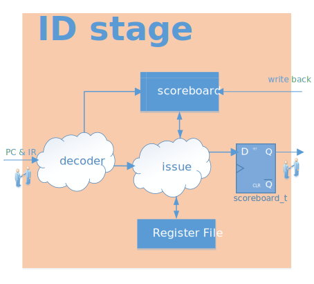

.. _id-stage:

Instruction Decode Stage
=========================

:file:`rtl/core/rvant_id_stage.sv`

   RVAnt ID Stage

ID stage receives and decodes instructions from previous IF stage, read out operators from ``Register File``, issue it to EX stage after resolving all hazards.

Instruction Decoder
--------------------

:file:`rtl/core/rvant_decoder.sv`

The decoder takes input instructions and decodes to generate control & data signals for EX stage.

Instruction Issue
--------------------

:file:`rtl/core/rvant_issue.sv`

The issue module is based on the scoreboard technique, which checks and resolves all hazards for each instruction. All operators is read out from register file at the same time when the instruction is send to EX stage.

Register File
--------------------

:file:`rtl/core/rvant_rf.sv`

The ``Register File`` can be made up by DFF or latch, the DFF version has better timing and latch version has better area. The flavo is selected via parameter ``REG_FILE`` defined in ``rtl/rvant_pkg.sv``.

.. todo::

   Only DFF flavo is available for now, implement the latch-based register file later.

Becuase RVAnt is a single issue in-order commit core, which means the register file is read by one instruction at any cycle, so it has 2 read ports and 1 write port.

The ``x0`` register is tied to zero according to the RISC-V spec, so the register file contains 31 32-bit registers.