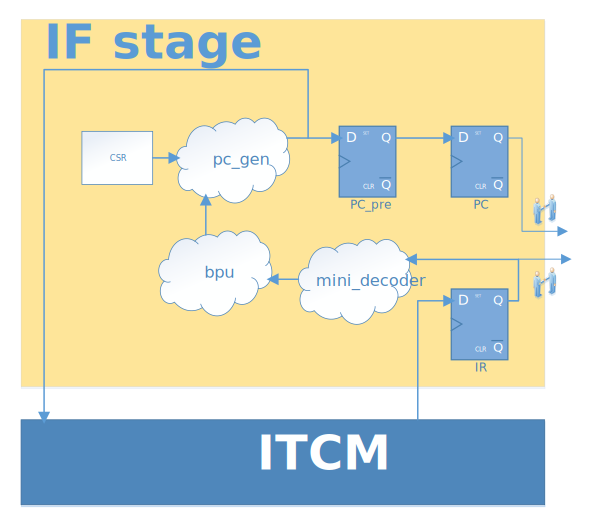

.. _if-stage:

Instruction Fetch Stage
=======================

:file:`rtl/core/rvant_if_stage.sv`

   RVAnt IF Stage

IF Stage(Instruction Fetch Stage) read instructions from outside memory, and send instructions to next stage at the speed of 1 instr/cycle. As following timing diagram shows, IR is one cycle later than PC_prev and PC_prev is generated according to the mini decoder result of IR.

.. wavedrom:: ../_static/if_stage.json
   :caption: IF Stage Fetch 1 Instruction Per Cycle
   :align: center

Misalign Access
---------------

Because RVAnt does NOT support **C** extension, so there are NO align problems.

Local Instruction buffer
-------------------------

Considering RVAnt is a minimal MCU core for low power application, the core is intergrated with a ``ITCM``, so it's not necessary to include a instruction FIFO or buffer in IF stage.

Branch Predicition
-------------------

:file:`rtl/core/rvant_bpu.sv`

IF stage includes a mini decoder to detect intruction type and related immediates and source register data. Because there are potential data and structural hazard, so mini decoder may stall the fetching process until resolving all hazards. The mini decoder is an instance of full decoder, but left unused output signals unconnected.

The BPU(Branch Prediction Unit) takes the output of mini_decoder and predicts the next ``PC`` according to current instruction. The control transfer instructions can be divided into 2 types: branch and jump.

Branch
   For branch instructions, RVAnt adopts the most basic ``BTFN`` (backward taken, forward not taken) algorithm to simplify hardware design and optimize the area.

Jump
   It's not necessary to predict the direction of ``JAL`` instruction, all we need is predicting the target address by ``PC+imm``.

   For ``JALR`` instruction, the target address is ``[rs1]+imm``, we can do some tricks to accelate the predication:
   
   - if rs1 is ``x0``, we can calculate the target address without any stall
   - if it's a call/return instrcution, we use a 4-depth ``RAS``
     - we forward rs1(``x1`` or ``x5``) from ``RF`` to BPU to accelate predication
     - forwarding logic does not occupy any read port of ``RF``
     - data hazards must be resolved before forwarding, including all instrcution in scoreboard and ``IR``, so there would be bubble in some situation
   - else, wait for resolving all hazards, read rs1 data from ``RF`` port0

PC generation
--------------------

:file:`rtl/core/rvant_pcgen.sv`

The next ``PC`` is generated according to control signals:

+ if the reset signal is assert, ``mrvec`` is assigned to ``PC`` (machine reset vector)
+ if input flush request is assert, flush request is assigned to ``PC``
+ if encounters any exception, ``mtevc`` is assigned to ``PC``
+ if branch prediciton is error, EX stage PC is assigned to ``PC``
+ if current is a branch/jump instruction, the prediciton result is assigned to ``PC``
+ else ``PC+4`` is assigned to ``PC``

Intruction Fetch Interface
---------------------------

The ITCM follows a protocal called ``RMI`` (RVAnt Memory Interface), which is divide into 2 channel: request channle and response channel. See :ref:`mem-intf` for more details.