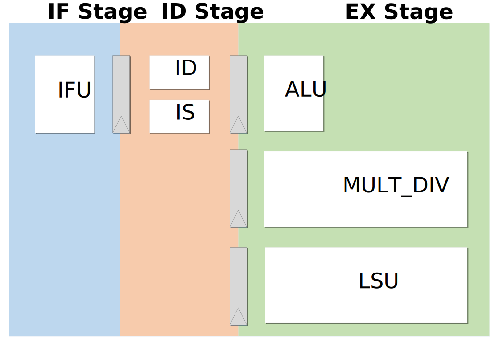

.. _pipeline-details:

Pipeline Details
================

RVAnt is a minimal 32-bit RISC-V core with 3 stage pipeline:

+ IF
+ ID/IS
+ EX/MEM/WB

   RVAnt Pipeline

Instruction Fetch
------------------

Fetch instructions from outside memory, i.e. ``ITCM`` or ``DDR``, capable of fetching 1 instr/cycle. RVAnt implements static branch prediction ``BTFN`` (backward taken, forward not taken) only, does NOT include any dynamic prediction algorithms. See :ref:`ifu` for details.

Instruction Decode and Issue
-----------------------------

This stage includes 3 functions:

+ Decode fetched instruction
+ resolve all hazards and issue instruction
+ read registers

See :ref:`id` for details.

Exection, Memory and Writeback
-----------------------------------

The exection of all instructions and writeback is performed in this stage. Most of instructions' exection is 1 cycle, while some multi-cycle instructions are list as below.

Multi-Cycle instructions
--------------------------

+------------------+-------------+-------------------------------------------------+
| Instruction Type | Stall Cycle | Decriptions                                     |
+==================+=============+=================================================+
| Load/Store       | 1 - N       | The total latency is affected by outside memory |
+------------------+-------------+-------------------------------------------------+
| Mult/Div         | 1 - N       | See details in :ref:`mult-div`                  |
+------------------+-------------+-------------------------------------------------+

.. todo::

   update block diagram
