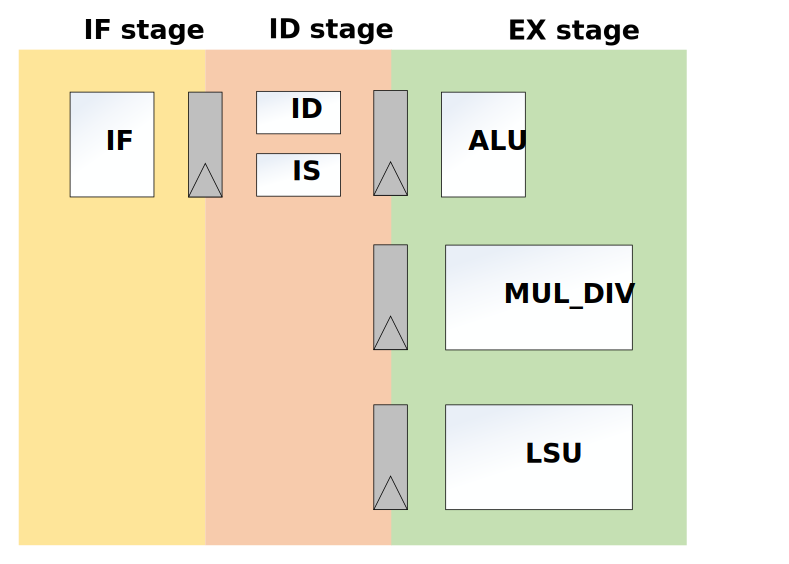

.. _pipeline-details:

Pipeline Details
==================

RVAnt is a minimal 32-bit RISC-V core with 3 stage pipeline:

+ IF (instruction fetch)
+ ID (instruction decode)
+ EX (execution)

   RVAnt Pipeline

Instruction Fetch
------------------

IF stage fetch instructions from outside memory, i.e. ``ITCM`` or ``DDR``, capable of fetching 1 instr/cycle. RVAnt implements static branch prediction ``BTFN`` (backward taken, forward not taken) only, does NOT include any dynamic prediction algorithms. See :ref:`if-stage` for details.

Instruction Decode and Issue
-----------------------------

This stage includes 3 functions:

+ decode the fetched instruction
+ resolve all hazards and issue instruction
+ read registers

See :ref:`id-stage` for details.

Exection, Memory and Writeback
-----------------------------------

The exection and writeback of all instructions is performed in this stage. Most of instructions' exection time is 1 cycle, while some multi-cycle instructions are list as below.

Multi-Cycle instructions
--------------------------

+------------------+-------------+-------------------------------------------------+
| Instruction Type | Stall Cycle | Decriptions                                     |
+==================+=============+=================================================+
| Load/Store       | 1 - N       | The total latency is affected by outside memory |
+------------------+-------------+-------------------------------------------------+
| Mult/Div         | 1 - N       | See details in :ref:`mult-div`                  |
+------------------+-------------+-------------------------------------------------+

Micro-Architecture
====================

The micro-architecture of RVAnt is showed as bellow:

.. figure:: ../_static/rvant_march.svg
   :alt:  rvant march
   :align: center

   RVAnt Micro-Architecture

.. todo::

   update diagrams for march and if/id/ex stage.
